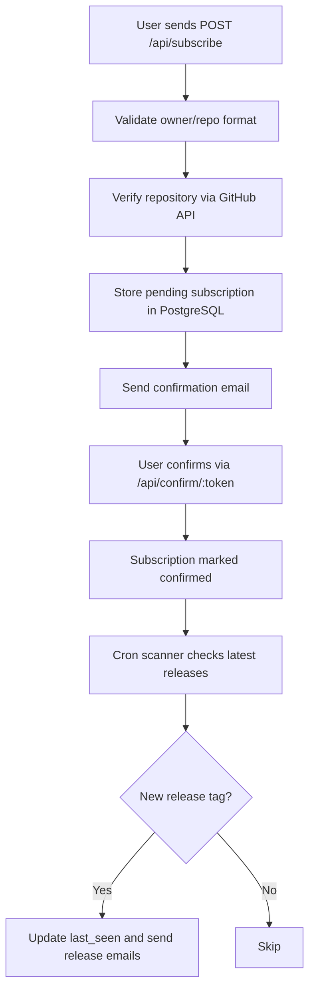

# GitHub Release Notifier

A production-style API that lets users subscribe to GitHub repositories and receive email notifications when new releases are published.

<p align="left">
  
  
  
  
  
  
  
  
</p>

## Table of Contents

- [What This Project Does](#what-this-project-does)
- [How It Works](#how-it-works)
- [Project Structure](#project-structure)
- [Quick Start (Local)](#quick-start-local)
- [Quick Start (Docker)](#quick-start-docker)
- [Environment Variables](#environment-variables)
- [API Reference](#api-reference)
- [Testing](#testing)
- [Troubleshooting](#troubleshooting)
- [Roadmap Ideas](#roadmap-ideas)
- [License](#license)

## What This Project Does

- Accepts subscriptions for repositories in `owner/repo` format.
- Validates repository existence using the GitHub API.
- Sends confirmation email before enabling notifications.
- Scans subscribed repositories on a schedule.
- Notifies confirmed users when a new release is published.
- Supports one-click unsubscribe with tokenized links.

## How It Works



## Project Structure

```text
github_release_notifier/
├── compose.yaml
├── Dockerfile
├── package.json
├── README.md
├── LICENSE
├── src/
│   ├── app.js
│   ├── controller/
│   │   └── subscriptionsController.js
│   ├── routes/
│   │   └── router.js
│   ├── services/
│   │   ├── api.service.js
│   │   ├── github.service.js
│   │   ├── scanner.service.js
│   │   ├── subscription.service.js
│   │   └── email/
│   │       └── emailService.js
│   ├── repositories/
│   │   ├── confirmSubscriptionDB.js
│   │   ├── selectSubscriptionsDB.js
│   │   ├── surbscribeDB.js
│   │   ├── unsubscribeDB.js
│   │   └── scanUpdates/
│   │       ├── getSubscribersForRepoDB.js
│   │       ├── scanDB.js
│   │       └── updateLastSeenDB.js
│   ├── db/
│   │   ├── pool.js
│   │   ├── migration.manager.js
│   │   └── migrations/
│   │       └── 01_scheme.sql
│   ├── templates/
│   │   ├── confirmation.html
│   │   └── release-notification.html
│   └── utils/
│       └── paths.js
└── tests/
    ├── e2e.ps1
    ├── email.manual.js
    └── githubService.test.js
```

### Layer Responsibilities

- `controller/`: HTTP handlers and response mapping.
- `services/`: business logic, external API calls, email workflows, and scanner.
- `repositories/`: SQL-level data access.
- `db/`: connection pool and migration runner.
- `templates/`: HTML email templates.

## Quick Start (Local)

### 1. Install dependencies

```bash
npm install
```

### 2. Create `.env`

```env
PORT=3000
NODE_ENV=development
BASE_URL=http://localhost:3000

DB_HOST=localhost
DB_PORT=5432
DB_NAME=github_release_notifier
DB_USER=postgres
DB_PASSWORD=postgres

SMTP_HOST=localhost
SMTP_PORT=1025
SMTP_USER=
SMTP_PASS=
EMAIL_FROM=noreply@github-notifier.com

GITHUB_TOKEN=
```

### 3. Start the app

```bash
npm run dev
```

## Quick Start (Docker)

This project includes:
- `db` (PostgreSQL)
- `mailhog` (SMTP testing + web UI)
- `server` (Fastify API)

### Run all services

```bash
docker compose up --build
```

### Open services

- API: `http://localhost:3000`
- MailHog UI: `http://localhost:8025`

## Environment Variables

| Variable | Required | Description |
|---|---|---|
| `PORT` | No | API port (default `3000`) |
| `NODE_ENV` | No | `development` or `production` |
| `BASE_URL` | Yes | Public base URL for email links |
| `DB_HOST` | Yes | PostgreSQL host (`db` in Docker) |
| `DB_PORT` | Yes | PostgreSQL port (usually `5432`) |
| `DB_NAME` | Yes | Database name used by application |
| `DB_USER` | Yes | Database user |
| `DB_PASSWORD` | Yes | Database password |
| `SMTP_HOST` | Yes | SMTP host (`mailhog` in Docker network) |
| `SMTP_PORT` | Yes | SMTP port (`1025` for MailHog) |
| `SMTP_USER` | No | SMTP auth user (empty for MailHog) |
| `SMTP_PASS` | No | SMTP auth password (empty for MailHog) |
| `EMAIL_FROM` | No | Sender email address |
| `GITHUB_TOKEN` | No | Improves GitHub API rate limits |

## API Reference

Base path: `/api`

### `POST /subscribe`

Create a new pending subscription and send a confirmation email.

Request body:

```json
{
  "email": "user@example.com",
  "repo": "facebook/react"
}
```

Success response:

```json
{
  "status": 201,
  "message": "Confirmation letter was sent, check your email"
}
```

### `GET /confirm/:token`

Confirm a pending subscription.

### `GET /unsubscribe/:token`

Remove an existing subscription.

### `GET /subscriptions?email=user@example.com`

Fetch all confirmed subscriptions for an email.

## API Playground (cURL)

```bash
curl -X POST http://localhost:3000/api/subscribe \
  -H "Content-Type: application/json" \
  -d '{"email":"user@example.com","repo":"facebook/react"}'
```

```bash
curl "http://localhost:3000/api/subscriptions?email=user@example.com"
```

## Testing

Run end-to-end script:

```bash
npm run test:e2e
```

Manual helpers are available in `tests/`.

## Troubleshooting

<details>
<summary>Connection timeout during migrations</summary>

- Ensure PostgreSQL is running and reachable.
- Ensure `DB_HOST`, `DB_PORT`, `DB_NAME`, `DB_USER`, and `DB_PASSWORD` match the actual database.
- In Docker, app container should use `DB_HOST=db` and internal DB port `5432`.
</details>

<details>
<summary>Emails are not arriving</summary>

- Check SMTP variables.
- If using MailHog, use `SMTP_HOST=mailhog` and `SMTP_PORT=1025` in Docker.
- Open `http://localhost:8025` to inspect captured emails.
</details>

<details>
<summary>GitHub rate limit errors (429/403)</summary>

- Set `GITHUB_TOKEN` in your environment.
- Retry after the rate limit window resets.
</details>

## Roadmap Ideas

- Add request validation schema for Fastify routes.
- Add unit tests for services and repositories.
- Add OpenAPI/Swagger documentation.
- Add retry strategy for transient GitHub and SMTP failures.
- Add metrics and health endpoints (`/health`, `/ready`).

## License

MIT
